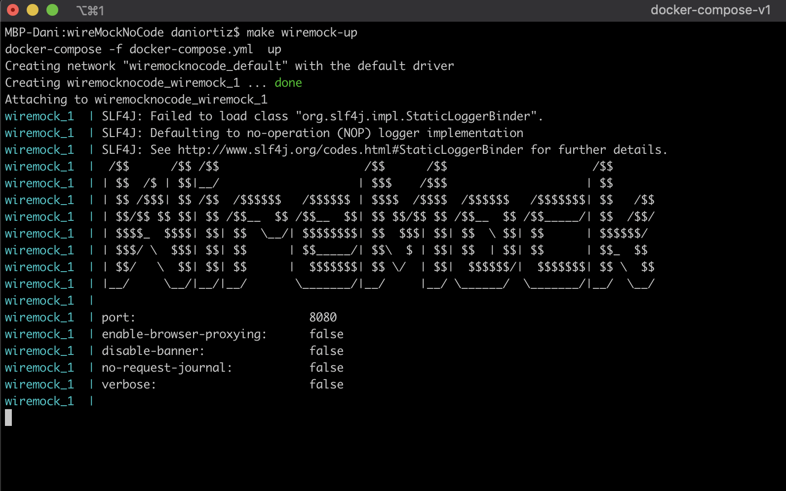
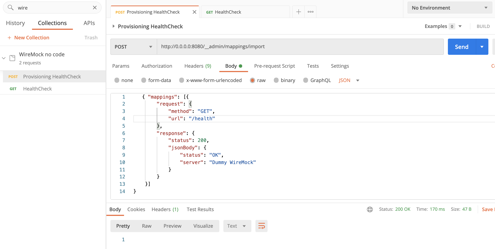
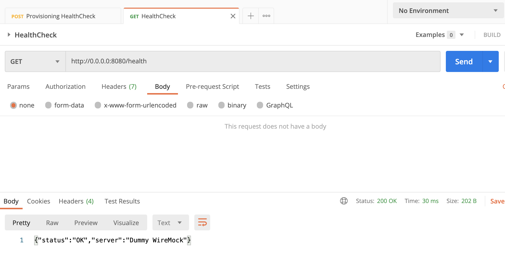
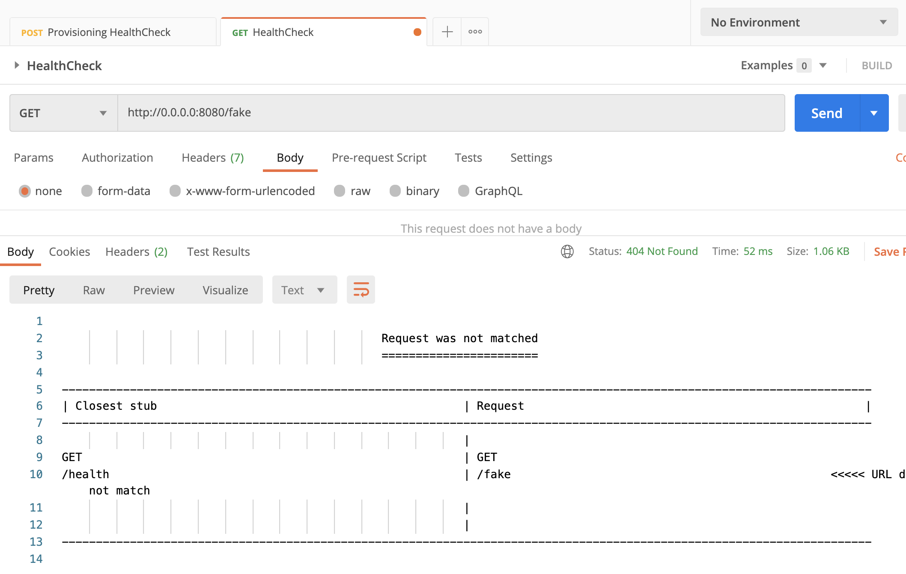

# WireMock no code

## Index

- [Stack info](#stack-info)
- [Summary](#Summary)
- [How to work](#how-to-work)
    - [Start](#start)
    - [Provisioning](#provisioning)
    - [How to test](#how-to-test)
    
## Stack info
- Docker 20.10.8

## Summary

It is a very very simple repository to show the power of (WireMock)[http://wiremock.org/] functionality. 
We just start a service through docker with a docker compose, provision the server with a request and test its operation.

## How to work

### Start

The first step is to set up the server. If your operating system is unix type:
```shell script
make make wiremock-up
```

 If not, run the docker service directly:
```shell script
docker-compose -f docker-compose.yml  up
```



Now import the Postman collection included [here](resources/WireMockNoCode.postman_collection.json) to follow the example.

### Provisioning

From Postman (or other similar software) we launch a request to the server to provision it with an operation:



**Important**: Note that this is a very simple example, there is a whole list of complex cases here.


### How to test

We check that the operation has been saved correctly and works:



We change the request to check that the server returns an error:



Once you are done simply shut down the docker service:

```shell script
make make wiremock-down
```
or
```shell script
docker-compose -f docker-compose.yml  down
```


